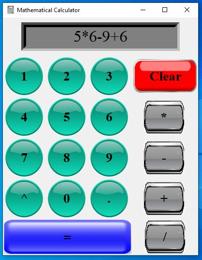

<h1 align="center">
   Calculator 
</h1>
<h2 align="left">Introduction</h2>
In this project, a simple calculator is made using tkinter library. It can perform simple mathematical calculation like addition, subtraction, multiplication, division and so on. It also can perform multiple calculation at a single time also.
<h2 align="left">Screen short of calculator</h2>

<h2 align="left">Functions of the calculator</h2>
This mathematical calculater can perform these functions:
*Addition
*Subtraction
*Multiplication

